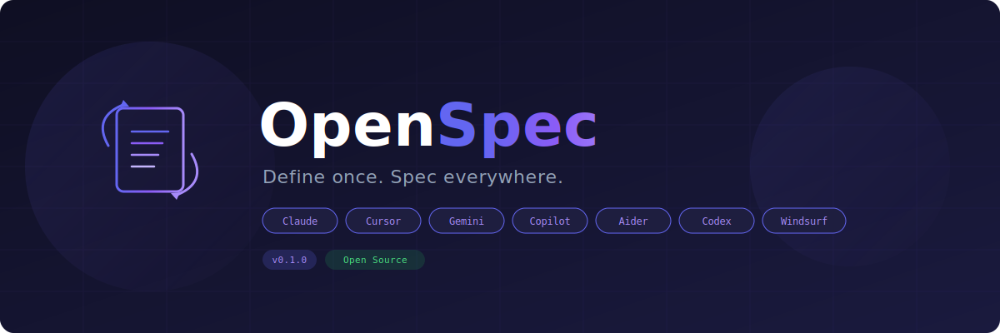

<p align="center">
  
</p>

<p align="center">
  <strong>The universal AI context transpiler.</strong><br/>
  Write your project rules once. OpenSpec generates the correct context file for every AI tool in your stack.
</p>

<p align="center">
  <a href="#-quickstart"><strong>Quickstart</strong></a> ·
  <a href="#-why-openspec"><strong>Why?</strong></a> ·
  <a href="#%EF%B8%8F-architecture"><strong>Architecture</strong></a> ·
  <a href="#-configuration"><strong>Config</strong></a> ·
  <a href="#-contributing"><strong>Contributing</strong></a>
</p>

<p align="center">
  
  
  
  
  
</p>

---

## The Problem

Every AI tool has its own context file:

| Tool | File |
|------|------|
| Claude Code | `CLAUDE.md` |
| Cursor | `.cursorrules` |
| Google Gemini | `GEMINI.md` |
| GitHub Copilot | `.github/copilot-instructions.md` |
| Aider | `.aiderrules` |
| OpenAI Codex | `AGENTS.md` |
| Windsurf | `.windsurfrules` |

When you update a convention — say, _"always use parameterized queries"_ — you have to copy-paste it into **7 different files**. Miss one, and that AI starts writing bad code. Your team now has a **context fragmentation** problem.

## The Solution

```
.openspec/modules/           ← You write rules HERE (once)
  ├── shared.md
  ├── frontend.md
  ├── backend.md
  └── testing.md
        │
        ▼  openspec sync
        │
  CLAUDE.md                  ← Generated
  .cursorrules               ← Generated
  GEMINI.md                  ← Generated
  AGENTS.md                  ← Generated
  .aiderrules                ← Generated
  .windsurfrules             ← Generated
  .github/copilot-instructions.md  ← Generated
```

**One source of truth. Seven outputs. Zero drift.**

---

## ⚡ Quickstart

```bash
# Install
npm install -g openspec

# Initialize in your project
cd your-project
openspec init

# Edit your rules
# (customize the modules in .openspec/modules/)

# Generate all AI context files
openspec sync

# Or auto-sync on every change
openspec watch
```

That's it. Every AI tool in your stack now reads the same rules.

---

## 🧠 Why OpenSpec?

<table>
<tr>
<td width="50%">

### Without OpenSpec

```
❌ Update rule in CLAUDE.md
❌ Forget to update .cursorrules
❌ Cursor AI writes conflicting code
❌ 2 hours debugging AI-generated drift
❌ Team argues about which file is "correct"
```

</td>
<td width="50%">

### With OpenSpec

```
✅ Update rule in .openspec/modules/backend.md
✅ Run 'openspec sync' (or auto-watch)
✅ All 7 files updated instantly
✅ Every AI tool follows the same conventions
✅ Single source of truth in version control
```

</td>
</tr>
</table>

---

## 📖 How It Works

### 1. Modular Rule Files

Rules live in `.openspec/modules/` as Markdown files with optional YAML frontmatter:

```markdown
---
name: Backend Conventions
description: API and database rules for the backend
priority: 20
tags: [backend, api]
---

- Use dependency injection for all services
- All API endpoints must validate input with Zod schemas
- Database queries must use parameterized statements
- Use structured logging (pino), never console.log
- Tenant ID must be extracted from JWT, never from request body
```

### 2. Smart Frontmatter

Each module can control exactly where it appears:

```yaml
---
name: React Conventions
priority: 20

# Only include this module in Cursor and Claude outputs:
targets: [cursor, claude]

# Or exclude from specific targets:
excludeTargets: [aider]

# Hint which files this rule applies to:
globs: ["src/components/**/*.tsx"]

tags: [frontend, react]
---
```

| Field | Type | Description |
|-------|------|-------------|
| `name` | `string` | Display name (defaults to filename) |
| `description` | `string` | One-line description |
| `priority` | `number` | Sort order — lower numbers appear first (default: `50`) |
| `targets` | `string[]` | Whitelist: only include in these targets |
| `excludeTargets` | `string[]` | Blacklist: exclude from these targets |
| `globs` | `string[]` | File patterns this rule is relevant to |
| `tags` | `string[]` | Organizational tags |

### 3. Per-Target Rendering

OpenSpec doesn't just concatenate files — it **adapts the output** for each tool's conventions:

- **Claude Code** → flat `##` headings, no separators (Claude prefers dense context)
- **Cursor** → `##` headings with glob comments for scoped rules
- **Copilot** → `###` headings (fits within Copilot's instruction hierarchy)
- **Others** → `##` headings with `---` separators for readability

---

## 🔧 CLI Reference

```
Usage: openspec [command] [options]

Commands:
  init              Scaffold .openspec/ with config + example modules
  sync [--quiet]    Compile modules → generate all AI context files
  watch             Watch for module changes, auto-sync on save
  status            Show modules, targets, and sync status
  diff              Preview what changes sync would make
  add <name>        Create a new rule module (--priority, --targets, --tags)
  hooks [--remove]  Install/remove git pre-commit hook
  clean             Remove all generated files (only openspec-managed)
  help [command]    Show help for a command
```

### `openspec init`

Creates the `.openspec/` directory with a config file and four example modules:

```
.openspec/
  config.yaml
  modules/
    shared.md       ← Core project rules
    frontend.md     ← Frontend conventions
    backend.md      ← Backend conventions
    testing.md      ← Testing standards
```

### `openspec sync`

Reads all modules, filters per target, renders, and writes output files:

```
$ openspec sync

Found 4 module(s): shared, backend, frontend, testing

  ✓ Claude Code (CLAUDE.md)     → CLAUDE.md (4 modules, 1.0KB)
  ✓ Cursor (.cursorrules)       → .cursorrules (4 modules, 1.0KB)
  ✓ Gemini (GEMINI.md)          → GEMINI.md (4 modules, 1.2KB)
  ✓ GitHub Copilot              → .github/copilot-instructions.md (4 modules, 1.0KB)
  ✓ Aider (.aiderrules)         → .aiderrules (4 modules, 1.2KB)
  ✓ OpenAI Codex (AGENTS.md)    → AGENTS.md (4 modules, 1.2KB)
  ✓ Windsurf (.windsurfrules)   → .windsurfrules (4 modules, 1.2KB)

✓ Synced 7 target(s) successfully.
```

### `openspec watch`

Runs an initial sync, then watches `.openspec/modules/` for changes:

```
$ openspec watch

✓ Synced 7 target(s) successfully.

👀 Watching for changes in .openspec/modules
   Press Ctrl+C to stop.

⚡ Modified: .openspec/modules/backend.md
✓ Synced 7 target(s)
```

### `openspec hooks`

Installs a git pre-commit hook that auto-syncs before every commit:

```bash
openspec hooks           # Install pre-commit hook
openspec hooks --remove  # Remove it
```

This ensures generated files never fall out of sync, even if a developer forgets to run `openspec sync`.

### `openspec diff`

Preview what changes `sync` would make without writing any files:

```
$ openspec diff

openspec diff — preview changes

+ Claude Code (CLAUDE.md) (new file: CLAUDE.md)
~ Cursor (.cursorrules) (.cursorrules)
  - - Old rule
  + - Updated rule
  Gemini (GEMINI.md) — no changes

Run 'openspec sync' to apply these changes.
```

### `openspec add <name>`

Quickly scaffold a new module:

```bash
openspec add "api security"                              # Creates api-security.md
openspec add auth --priority 15 --targets claude,cursor   # With options
openspec add styling --tags css,frontend                  # With tags
```

### `openspec status`

Shows current modules and whether each target file exists and is managed:

```
$ openspec status

openspec status

Modules: (.openspec/modules)
  Project Overview (priority: 10)
  Backend Conventions [backend, api] (priority: 20)
  Frontend Conventions [frontend, react] (priority: 20)
  Testing Standards [testing] (priority: 30)

Targets:
  Claude Code (CLAUDE.md): synced
  Cursor (.cursorrules): synced
  Gemini (GEMINI.md): synced
  GitHub Copilot: synced
  Aider (.aiderrules): missing — run 'openspec sync'
  OpenAI Codex (AGENTS.md): synced
  Windsurf (.windsurfrules): synced
```

---

## ⚙️ Configuration

Config lives at `.openspec/config.yaml`:

```yaml
version: 1
modulesDir: ".openspec/modules"

# Optional global header/footer for all outputs
shared:
  header: "# Project AI Rules"
  footer: "---\nGenerated by openspec"

targets:
  claude:
    enabled: true
    output: CLAUDE.md

  cursor:
    enabled: true
    output: .cursorrules
    modules: [shared, frontend]   # Only include these modules

  gemini:
    enabled: true
    output: GEMINI.md

  copilot:
    enabled: true
    output: .github/copilot-instructions.md

  aider:
    enabled: false                # Disable this target entirely

  codex:
    enabled: true
    output: AGENTS.md

  windsurf:
    enabled: true
    output: .windsurfrules
```

### Config options

| Key | Type | Default | Description |
|-----|------|---------|-------------|
| `version` | `number` | `1` | Config version (for future migrations) |
| `modulesDir` | `string` | `.openspec/modules` | Where to find module files |
| `shared.header` | `string` | — | Prepended to all outputs |
| `shared.footer` | `string` | — | Appended to all outputs |
| `targets.<name>.enabled` | `boolean` | `true` | Enable/disable a target |
| `targets.<name>.output` | `string` | (per target) | Output file path |
| `targets.<name>.modules` | `string[]` | (all) | Explicit module whitelist |
| `targets.<name>.header` | `string` | — | Per-target header (overrides shared) |

### Config file locations

OpenSpec searches for config in this order:

1. `.openspec/config.yaml`
2. `.openspec/config.yml`
3. `.openspec/config.json`
4. `openspec.config.yaml`
5. `openspec.config.yml`
6. `openspec.config.json`

---

## 🏗️ Architecture

```
┌──────────────────────────────────────────────────────────┐
│                    .openspec/modules/                     │
│  ┌──────────┐  ┌──────────┐  ┌──────────┐  ┌──────────┐ │
│  │shared.md │  │frontend  │  │backend   │  │testing   │ │
│  │prio: 10  │  │prio: 20  │  │prio: 20  │  │prio: 30  │ │
│  └────┬─────┘  └────┬─────┘  └────┬─────┘  └────┬─────┘ │
└───────┼──────────────┼──────────────┼──────────────┼──────┘
        │              │              │              │
        ▼              ▼              ▼              ▼
┌──────────────────────────────────────────────────────────┐
│               Module Discovery & Filtering               │
│  • Discover all .md files in modulesDir                   │
│  • Parse YAML frontmatter (gray-matter)                  │
│  • Sort by priority, then alphabetically                 │
│  • Filter per target (whitelist/blacklist)                │
└──────────────────────┬───────────────────────────────────┘
                       │
        ┌──────────────┼──────────────┐
        ▼              ▼              ▼
┌──────────────┐┌──────────────┐┌──────────────┐
│Claude Renderer││Cursor Renderer││ Default      │
│ Flat ## heads ││ ## + globs   ││ ## + ---     │
└──────┬───────┘└──────┬───────┘└──────┬───────┘
       │               │               │
       ▼               ▼               ▼
   CLAUDE.md      .cursorrules    GEMINI.md
                                  AGENTS.md
                                  .aiderrules
                                  .windsurfrules
                                  copilot-instructions.md
```

### Three integration layers

| Layer | Command | When it runs | Use case |
|-------|---------|-------------|----------|
| **CLI** | `openspec sync` | Manual / CI | One-shot generation |
| **Watcher** | `openspec watch` | During development | Auto-sync on save |
| **Git Hook** | `openspec hooks` | Pre-commit | Safety net — never commit stale files |

### Tech Stack

| Component | Technology | Why |
|-----------|-----------|-----|
| Language | TypeScript (ESM) | Type safety, ecosystem |
| CLI Framework | Commander.js | Battle-tested, zero config |
| File Watching | chokidar | Cross-platform, efficient |
| Frontmatter | gray-matter | Industry standard |
| Config | js-yaml | YAML is friendlier for config |
| Build | tsc | Simple, fast, no bundler needed |

---

## 🗂️ Project Structure

```
openspec/
├── src/
│   ├── cli.ts              # CLI entry point (Commander)
│   ├── compiler.ts          # Core compilation orchestrator
│   ├── config.ts            # Config discovery & loading
│   ├── modules.ts           # Module discovery & filtering
│   ├── hooks.ts             # Git hook install/remove
│   ├── watcher.ts           # File watcher (chokidar)
│   ├── types.ts             # TypeScript types & defaults
│   ├── commands/
│   │   ├── init.ts          # 'openspec init' scaffolding
│   │   ├── sync.ts          # 'openspec sync' handler
│   │   └── status.ts        # 'openspec status' handler
│   └── targets/
│       └── index.ts         # Per-target renderers
├── assets/
│   ├── banner.svg           # README banner
│   └── logo.svg             # Project icon
├── .openspec/               # Example config (dogfooding)
│   ├── config.yaml
│   └── modules/
├── package.json
├── tsconfig.json
└── LICENSE
```

---

## 🤝 Contributing

Contributions are welcome! See [CONTRIBUTING.md](CONTRIBUTING.md) for guidelines.

### Quick dev setup

```bash
git clone https://github.com/user/openspec.git
cd openspec
npm install
npm run dev -- init    # Test the CLI via tsx
npm run dev -- sync
npm run build          # Compile TypeScript
```

### Ideas for contributions

- **New targets** — Add renderers for new AI tools as they emerge
- **MCP server mode** — `openspec mcp` for native Claude/Cursor integration
- **Module inheritance** — `extends: base.md` for DRY composition
- **Template variables** — `{{projectName}}` interpolation
- **VS Code extension** — GUI for managing modules
- **Monorepo support** — Per-package module overrides

---

## 📋 Roadmap

- [x] Core transpiler engine
- [x] 7 target outputs (Claude, Cursor, Gemini, Copilot, Aider, Codex, Windsurf)
- [x] YAML frontmatter with priority, targeting, tags
- [x] File watcher with debounced auto-sync
- [x] Git pre-commit hook integration
- [x] `init` / `sync` / `watch` / `status` / `clean` / `diff` / `add` commands
- [x] `openspec diff` — preview changes before syncing
- [x] `openspec add <name>` — scaffold new modules from CLI
- [x] CI pipeline (GitHub Actions — Linux/macOS/Windows, Node 18/20/22)
- [x] Test suite (vitest, 28 tests)
- [ ] `npx openspec` — zero-install usage (publish to npm)
- [ ] MCP server mode for dynamic context
- [ ] Module inheritance & composition
- [ ] Template variable interpolation
- [ ] Monorepo support
- [ ] VS Code / JetBrains extensions
- [ ] Remote module registries (share rules across repos)

---

## 📄 License

MIT — see [LICENSE](LICENSE) for details.

---

<p align="center">
  <strong>Stop copy-pasting AI rules.</strong><br/>
  <code>npx openspec init && npx openspec sync</code>
</p>
